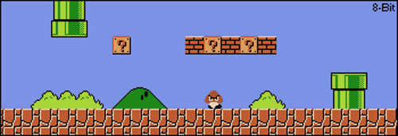

### 👋 G'day Mate, I’m Chris (@buptcuican)  
<!--  -->

- 💻 **Technical Expertise**  
5+ years Java developer, 4 years in financial securities core system development. Skilled in Java web architecture, CI/CD, knowledge systems, and data workflows.  

- 👥 **Team Leadership**  
Led a 10-member team, translating complex business requirements into clean and maintainable code.  

- ⚡ **Problem Solving**  
Proven ability to deliver under high-pressure environments.  

- 🤖 **Future Mindset**  
Actively embracing AI’s transformation of software development.  

## Skills

## Contact
📩 Reach me [here](https://www.linkedin.com/in/chriscuimelbourne/)

## Stats 
<!--Snake Contributions-->
<picture>
  <source media="(prefers-color-scheme: dark)" srcset="https://raw.githubusercontent.com/buptcuican/buptcuican/output/github-contribution-grid-snake-dark.svg">
  <source media="(prefers-color-scheme: light)" srcset="https://raw.githubusercontent.com/buptcuican/buptcuican/output/github-contribution-grid-snake.svg">
  
</picture>
 
🐍Animation created with [Platane/snk](https://github.com/Platane/snk)
 
 

---

  

  

